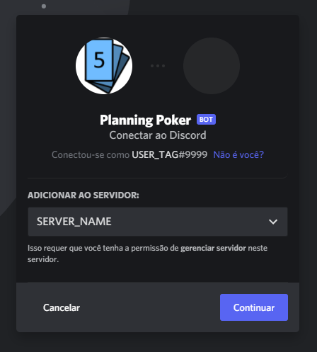

# Planning Poker Discord BOT

O Planning Poker BOT é uma ferramenta para auxiliar sua equipe nas tarefas de estimativa e planejamento, seguindo o padrão SCRUM.

## Instalação

Para instalar o Planning Poker BOT, é necessário ter um servidor no Discord e ter as permissões necessárias para adicioná-lo.
Você pode clicar [nesse link](https://bit.ly/DiscordPlanningPokerBot) para convidá-lo a entrar em seu servidor.

## Iniciando

Com o bot adicionado ao servidor, reúna seus participantes em um canal de texto. 

Cada planning é vinculada à um único canal de texto, ou seja, os comandos serão reconhecidos apenas no canal em que a planning foi iniciada.

Você pode criar mais de uma planning em paralelo em seu servidor, cada uma em um canal específico. 

Recomendamos a criação de um canal específico para jogar o Planning Poker.

Assim que todos estiverem prontos, para começar a planning, digite o comando `!start`.

## Tipos de Participantes

Ao iniciar uma nova planning, o bot enviará uma mensagem disponibilizando duas opções de participação:

#### ✔️ Participante
Recebe as estimativas via mensagem direta e pode votar.

#### 👀 Observador
Gerencia as estimativas e tem a permissão de iniciar, revelar, cancelar e reestimar.

## Criando uma nova história

Para apresentar uma história ou pergunta a ser estimada, basta digitar `!estimate` seguido da descrição do que deve ser estimado. Todos os participantes receberão uma mensagem direta onde poderão reagir com os emojis relacionados às pontuações.

**Você deve aguardar até o bot enviar todos os emojis para votar!**

A votação estará ativa até que os observadores revelem os votos.

Você pode mudar a sua estimativa a qualquer momento enquanto a votação estiver ativa reagindo com outro emoji de valor correspondente.

## Revelando os votos
Durante a votação, é possível acompanhar o status da votação e, após todos votarem, os observadores podem executar o comando `!reveal`, e o bot revelará os votos de cada participante.

*Obs: Não é necessário que todos tenham votado para executar esse comando.*

## Reestimando
Após revelar os votos, é disponibilizado a média e confiança dos votos, caso as estimativas estejam conflitantes, os observadores poderão reabrir a votação por meio do comando `!reestimate`, e assim os participantes poderão estimar novamente a história anterior.

## Cancelando uma estimativa
Caso tenha aberto uma estimativa incorretamente, é possível realizar o cancelamento da mesma, por meio do comando `!cancel`.

## Saindo 
Caso um participante (independente de sua role) precise sair durante a planning, basta realizar o comando `!leave` e já não receberá as mensagens e poderá entrar em outras plannings.

## Encerrando
No final de sua planning, basta você enviar o comando `!finish` e a planning será encerrada para esse canal.

## License
Nossa licença é do modelo [Donationware](https://wikipedia.org/wiki/Donationware).

Se você estiver usando e gostando, você pode fazer uma doação para ajudar a manter os nossos servidores no ar.

Pix: `18fc0afb-1844-403d-aec6-0cdf105991ee`

